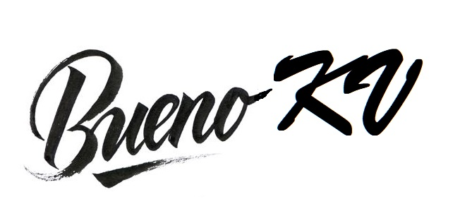

# BuenoKv
   

BuenoKv is a key/value database that uses the same semantics and serialization as DenoKv.    
The intension is to provide data that is both compatible with, and transferable to and from DenoKv.

## Goals
- Mirror most of the Deno.Kv API 
- Support consistent Key-Value CRUD using any persistence service 
- Implement serialization (codecs) for multipart-keys and values
  - See:  https://nhrones.github.io/kv-key-codec/ 
- Provide a consistent cache-service for typed collections
  - High performance data presentation and mutation
  - Instant filtering, ordering, pagination
  - See: https://nhrones.github.io/BuenoCache/
- Require no external dependencies (Deno not required)
- Full library is browser compatible

