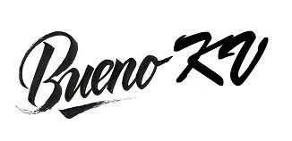

# BuenoKv
   

BuenoKv is a key/value database that uses the same semantics and serialization as DenoKv.    
The intension is to provide data that is both compatible with, and transferable to and from DenoKv.

## Goals
- Support consistent Key-Value CRUD using any persistence service 
- Mirror most of the Deno.Kv API 
- Implement serialization (codecs) for multipart-keys and values 
- Require no external dependencies (Deno not required)
- Full library is browser compatible

